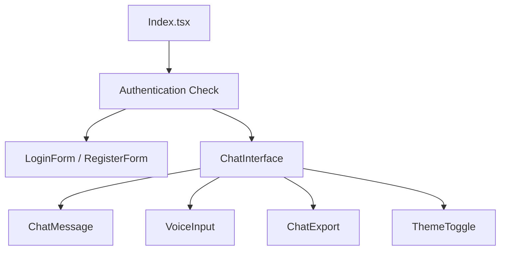

## 🚀 Features

### Core Features
- **Secure Authentication**: JWT-based login/register flows with form validation
- **Real-time Chat Interface**: Streaming messages with typing indicators
- **Responsive Design**: Mobile-first design with Tailwind CSS
- **Dark/Light Mode**: Beautiful theme switching with smooth transitions
- **TypeScript**: Full type safety throughout the application

### Bonus Features
- **🎤 Voice Input**: Speech-to-text functionality using Web Speech API
- **📱 Export Chat**: Download chat history as JSON or TXT files
- **✨ Smooth Animations**: Fade-in effects and micro-interactions
- **🎨 Glass-morphism UI**: Modern frosted glass design elements

## 🛠️ Technology Stack

- **Frontend**: React 18, TypeScript, Vite
- **Styling**: Tailwind CSS, shadcn/ui components
- **State Management**: React Hooks, Local Storage
- **Authentication**: JWT simulation (production-ready structure)
- **Icons**: Lucide React
- **Voice Features**: Web Speech API
- **Build Tool**: Vite
- **Code Quality**: ESLint, TypeScript strict mode

## 📦 Installation & Setup

### Prerequisites
- Node.js 18+ and npm/yarn
- Modern browser with Web Speech API support

### Quick Start
```bash
# Clone the repository
git clone <repository-url>
cd chatbot-ai

# Install dependencies
npm install

# Start development server
npm run dev
```

The application will be available at `http://localhost:8080`

### Build for Production
```bash
# Create production build
npm run build

# Preview production build
npm run preview
```

## 🏗️ Architecture Overview

```
src/
├── components/
│   ├── auth/
│   │   ├── LoginForm.tsx      # Login authentication form
│   │   └── RegisterForm.tsx   # Registration form
│   ├── chat/
│   │   ├── ChatInterface.tsx  # Main chat container
│   │   ├── ChatMessage.tsx    # Individual message component
│   │   ├── VoiceInput.tsx     # Speech-to-text functionality
│   │   └── ChatExport.tsx     # Export chat functionality
│   └── ui/
│       ├── ThemeToggle.tsx    # Dark/light mode toggle
│       └── [shadcn components] # Reusable UI components
├── hooks/
│   └── use-toast.ts          # Toast notifications hook
├── pages/
│   ├── Index.tsx             # Main application entry point
│   └── NotFound.tsx          # 404 error page
└── lib/
    └── utils.ts              # Utility functions
```

### Component Architecture



## 🔧 Key Components

### Authentication System
- **LoginForm**: Handles user login with email/password
- **RegisterForm**: User registration with validation
- **JWT Simulation**: Local storage-based session management

### Chat System
- **ChatInterface**: Main chat container with message management
- **ChatMessage**: Individual message rendering with reactions
- **Message Streaming**: Simulated real-time AI responses
- **Typing Indicators**: Visual feedback during AI response generation

### Voice Features
- **VoiceInput**: Speech-to-text using Web Speech API
- **Text-to-Speech**: AI response audio playback
- **Browser Compatibility**: Graceful fallback for unsupported browsers

### Export Functionality
- **JSON Export**: Structured chat data with metadata
- **Text Export**: Human-readable chat transcripts
- **Timestamp Preservation**: Full conversation history

## 🎨 Design System

### Color Palette
- **Primary**: Blue to Purple gradient (`from-blue-600 to-purple-600`)
- **Secondary**: Green to Blue gradient (`from-green-500 to-blue-500`)
- **Accent**: Purple to Pink gradient (`from-purple-600 to-pink-600`)
- **Background**: Subtle gradients with glass-morphism effects

### Typography
- **Headings**: Inter font with gradient text effects
- **Body**: System font stack for optimal readability
- **Code**: Monospace for technical content

### Animation & Interactions
- **Fade-in**: Smooth message appearance
- **Hover Effects**: Button and interactive element feedback
- **Loading States**: Spinner animations and skeleton screens
- **Theme Transitions**: Smooth dark/light mode switching

## 🔐 Security Considerations

### Current Implementation (Demo)
- Local storage-based authentication
- Client-side session management
- Simulated JWT tokens

### Production Recommendations
- Implement secure JWT handling with refresh tokens
- Add HTTPS enforcement
- Use secure HTTP cookies for session storage
- Implement rate limiting for API endpoints
- Add input sanitization and validation
- Use environment variables for sensitive config

## 🚀 Deployment

### Vercel (Recommended)
```bash
npm run build
# Deploy to Vercel
```


**Demo Credentials**: Use any email and password to sign in and explore the chatbot features!
